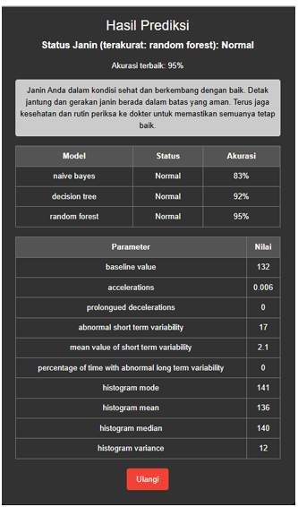
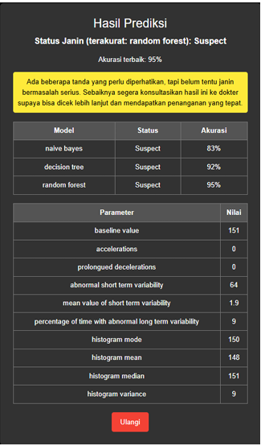
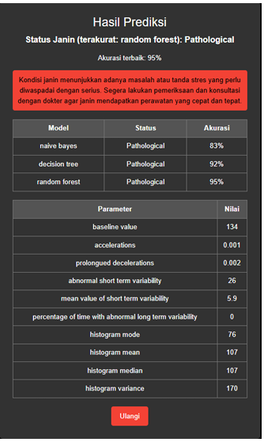

# 👶 Fetal Health Prediction App

Fetal Health Prediction App is a web-based application developed using **Python Flask** to predict fetal health conditions based on **Cardiotocography (CTG)** data. The application compares multiple machine learning algorithms to classify fetal health into **Normal**, **Suspect**, and **Pathological** conditions.

---

## 📖 Overview

Cardiotocography (CTG) is a medical technique used to monitor fetal well-being during pregnancy by recording fetal heart rate and uterine contractions.

This application allows users to input CTG parameters through a web interface. The entered data is processed using trained machine learning models to predict fetal health conditions. The project also compares several classification algorithms to determine the most accurate model.

---

## ✨ Features

- CTG data input through a web interface
- Automatic fetal health prediction
- Real-time prediction results
- Feature selection using **SelectKBest**
- Comparison of multiple machine learning algorithms
- Model performance evaluation
- Flask-based web application

---

## 🤖 Machine Learning Algorithms

The following machine learning algorithms were implemented and compared:

- Decision Tree
- Naive Bayes
- Random Forest

Among the evaluated models, **Random Forest** achieved the highest performance and was selected as the final prediction model.

---

## 🛠️ Technologies

- Python
- Flask
- Scikit-learn
- Pandas
- NumPy
- HTML
- CSS

---

## 📂 Project Structure

```text
fetal-health-prediction/
│
├── app.py
├── README.md
├── requirements.txt
│
├── assets/
│   ├── classification_report_dt.png
│   ├── classification_report_nb.png
│   ├── classification_report_rf.png
│   ├── confusion_matrix_dt.png
│   ├── confusion_matrix_nb.png
│   ├── confusion_matrix_rf.png
│   ├── logo.png
│   ├── prediksi_normal.png
│   ├── prediksi_pathological.png
│   └── prediksi_suspect.png
│
├── data/
│
├── templates/
│   ├── index.html
│   ├── dataset.html
│   ├── prediksi.html
│   └── profile.html
│
├── decision_tree_model.pkl
├── naive_bayes_model.pkl
├── random_forest_model.pkl
├── model_accuracies.pkl
├── rf_accuracy.pkl
├── selected_features.json
└── selected_features.pkl
```

---

## 📊 Dataset

This project uses the **Fetal Health Dataset**, which contains Cardiotocography (CTG) measurements used to classify fetal health into three categories:

| Label | Condition |
|------:|-----------|
| 1 | Normal |
| 2 | Suspect |
| 3 | Pathological |

---

## 📈 Model Evaluation

The models were evaluated using:

- Accuracy
- Precision
- Recall
- F1-Score
- Confusion Matrix

### Decision Tree

#### Classification Report


#### Confusion Matrix


---

### Naive Bayes

#### Classification Report


#### Confusion Matrix


---

### Random Forest

#### Classification Report


#### Confusion Matrix


---

## 🏆 Model Comparison

Among all evaluated models, **Random Forest** achieved the best overall performance, producing the highest accuracy, precision, recall, and F1-score while minimizing classification errors. Therefore, it was selected as the final prediction model used in this application.

---

## 📸 Prediction Results

### Normal



---

### Suspect



---

### Pathological



---

## 🚀 Getting Started

### 1. Clone the repository

```bash
git clone https://github.com/username/fetal-health-prediction.git
```

### 2. (Optional) Create a virtual environment

```bash
python -m venv venv
```

### 3. Install dependencies

```bash
pip install -r requirements.txt
```

### 4. Run the application

```bash
python app.py
```

Open your browser:

```text
http://127.0.0.1:5000
```

---

## 🎯 Project Objective

The objective of this project is to develop a web-based machine learning application capable of predicting fetal health conditions using Cardiotocography (CTG) data. By comparing multiple classification algorithms, the project identifies the most effective model for supporting early fetal health assessment.

---

## 📄 License

This project was developed for educational purposes and portfolio demonstration.
