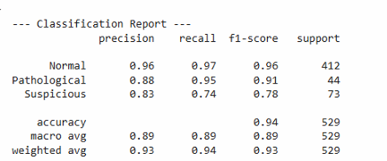
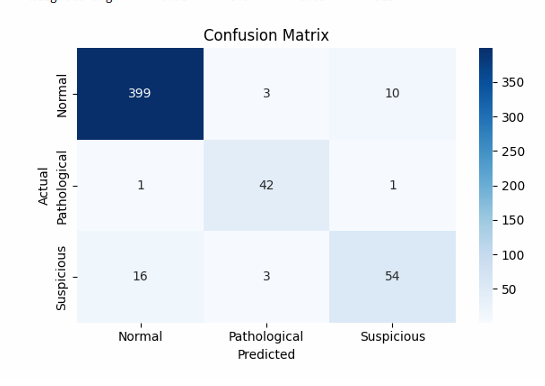
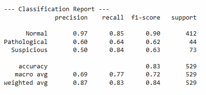
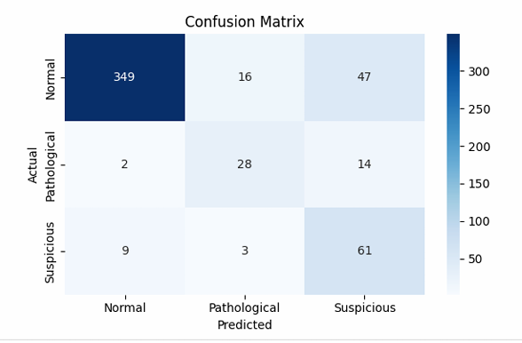
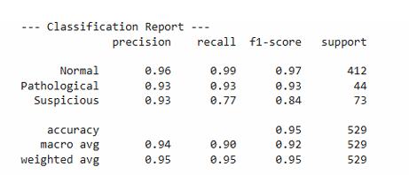
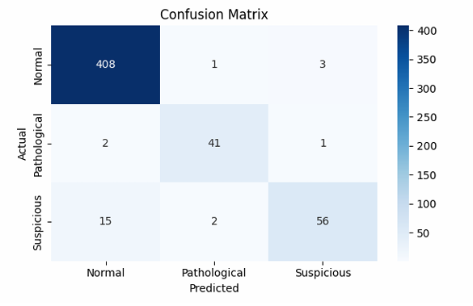

# Fetal Health Prediction App

Aplikasi **Fetal Health Prediction** adalah aplikasi berbasis web yang
digunakan untuk memprediksi kondisi kesehatan janin berdasarkan data
**Cardiotocography (CTG)** menggunakan algoritma **Machine Learning**.

Aplikasi ini dibangun menggunakan **Python Flask** sebagai backend dan
memanfaatkan model machine learning untuk melakukan klasifikasi kondisi
kesehatan janin.

## Deskripsi Proyek

Cardiotocography (CTG) merupakan metode yang digunakan untuk memantau
kondisi kesehatan janin selama masa kehamilan dengan mengukur detak
jantung janin dan kontraksi rahim.

Melalui data CTG tersebut, model machine learning dapat digunakan untuk
melakukan klasifikasi kondisi janin menjadi:

-   Normal
-   Suspect
-   Pathological

Aplikasi ini memungkinkan pengguna untuk memasukkan parameter CTG
melalui form web, kemudian sistem akan memproses data tersebut
menggunakan model machine learning dan menampilkan hasil prediksi
kondisi kesehatan janin.

## Fitur Aplikasi

-   Input data CTG melalui web interface
-   Prediksi kondisi kesehatan janin
-   Menampilkan hasil klasifikasi secara langsung
-   Implementasi berbasis web menggunakan Flask
-   Feature selection menggunakan SelectKBest
-   Perbandingan beberapa model Machine Learning

## Teknologi yang Digunakan

-   Python
-   Flask
-   Scikit-learn
-   Pandas
-   NumPy
-   HTML
-   CSS

## Struktur Proyek

    fetal-health-app
    │
    ├── app.py
    ├── README.md
    ├── requirements.txt
    │
    ├── assets
    │   └── gambar
    │
    ├── data
    │   └── dataset
    │
    ├── templates
    │   ├── index.html
    │   ├── dataset.html
    │   ├── prediksi.html
    │   └── profile.html
    │
    ├── decision_tree_model.pkl
    ├── naive_bayes_model.pkl
    ├── random_forest_model.pkl
    ├── model_accuracies.pkl
    ├── rf_accuracy.pkl
    │
    ├── selected_features.json
    └── selected_features.pkl

## Dataset

Dataset yang digunakan adalah **Fetal Health Dataset** yang berasal dari
rekaman **Cardiotocography (CTG)**.

Dataset memiliki beberapa fitur seperti:

-   baseline value
-   accelerations
-   fetal movement
-   uterine contractions
-   light decelerations
-   severe decelerations
-   prolonged decelerations
-   abnormal short term variability
-   mean value of short term variability
-   percentage of time with abnormal long term variability
-   histogram mean
-   histogram median
-   histogram variance

Label pada dataset terdiri dari:

  Label   Keterangan
  ------- --------------
  1.       Normal
  2.      Suspect
  3.       Pathological

## Instalasi

### 1. Clone Repository

    git clone https://github.com/username/fetal-health-app.git
    cd fetal-health-app

### 2. Membuat Virtual Environment (Opsional)

    python -m venv venv

Aktifkan environment:

Windows

    venv\Scripts\activate

Mac / Linux

    source venv/bin/activate

### 3. Install Dependencies

    pip install -r requirements.txt

## Menjalankan Aplikasi

Jalankan aplikasi Flask dengan perintah:

    python app.py

Buka browser dan akses:

    http://127.0.0.1:5000

## Cara Menggunakan Aplikasi

1.  Buka aplikasi di browser
2.  Masukkan nilai parameter CTG pada form input
3.  Klik tombol **Predict**
4.  Sistem akan memproses data menggunakan model machine learning
5.  Hasil prediksi kondisi kesehatan janin akan ditampilkan

## Evaluasi Model

Model dievaluasi menggunakan beberapa metrik evaluasi untuk mengetahui performa model dalam melakukan klasifikasi kondisi kesehatan janin. Beberapa metrik evaluasi yang digunakan antara lain:

- Accuracy
- Precision
- Recall
- F1-score
- Confusion Matrix

Metrik ini digunakan untuk mengukur seberapa baik model dalam mengklasifikasikan kondisi kesehatan janin ke dalam tiga kategori yaitu **Normal**, **Suspect**, dan **Pathological**.

---

## Hasil Evaluasi Model

### Decision Tree

Berikut merupakan hasil evaluasi model **Decision Tree** yang ditampilkan dalam bentuk classification report dan confusion matrix.

#### Classification Report

#### Confusion Matrix

---

### Naive Bayes

Berikut merupakan hasil evaluasi model **Naive Bayes** yang ditampilkan dalam bentuk classification report dan confusion matrix.

#### Classification Report

#### Confusion Matrix

---

### Random Forest

Berikut merupakan hasil evaluasi model **Random Forest** yang ditampilkan dalam bentuk classification report dan confusion matrix.

#### Classification Report

#### Confusion Matrix

---

## Perbandingan Performa Model

Berdasarkan hasil evaluasi yang dilakukan terhadap tiga algoritma klasifikasi yaitu **Decision Tree**, **Naive Bayes**, dan **Random Forest**, diperoleh bahwa model **Random Forest** memiliki performa yang paling baik dalam melakukan klasifikasi kondisi kesehatan janin.

Hal ini dapat dilihat dari nilai **accuracy, precision, recall, dan F1-score** yang lebih tinggi dibandingkan dengan model lainnya. Selain itu, confusion matrix juga menunjukkan bahwa model Random Forest mampu mengklasifikasikan data dengan tingkat kesalahan yang lebih kecil.

Dengan demikian, model **Random Forest** dipilih sebagai model utama yang digunakan dalam aplikasi prediksi kesehatan janin berbasis web ini.

---

